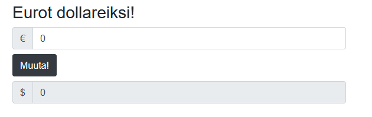

# Blazor


### Sisällyksen pöytä

# Yleistä
Blazor on Microsoftin kehittämä Front-end web-sovelluskehys, minkä avulla pystytään luomaan SPA-sovelluksia hyödyntämällä C#-ohjelmointikieltä ja .NET-ympäristöä. Tästä syystä websovelluskehityksen tukena on laaja kirjo Microsoftin kehittämiä kirjastoja, sekä valmis infrastruktuuri kehitystä varten.

## .NET
Kuten edellisessä kappaleessa kerrottiin, .NET-ohjelmistokehys tarjoaa laajan valikoiman kirjastoja sovelluskehitykseen. Näistä kaikille tutuin kirjasto Ohjelmoinnin Perusteet-kurssilta lienee System, mikä on C#-kielen olennaisin kirjasto.
```c#
System.Console.Writeline("Hello World!");
```
_Yllä oleva esimerkki kuvastaa System-nimiavaruudesta löytyvän Console-luokan Writeline-metodia._

Kattavan luokkakirjaston lisäksi muita .NET:n ominaisuuksia voi lukea [**tästä linkistä!**](https://docs.microsoft.com/fi-fi/dotnet/standard/)

[**.NET Core vs .NET Framework**](https://docs.microsoft.com/fi-fi/dotnet/standard/choosing-core-framework-server?toc=%2Faspnet%2Fcore%2Ftoc.json&bc=%2Faspnet%2Fcore%2Fbreadcrumb%2Ftoc.json&view=aspnetcore-3.0) - Hyödyllinen linkki kertomaan näiden kahden termin eroja ja niiden eri käyttötarkoituksista.

[**.NET:n Github-repositorio**](https://github.com/dotnet)

## ASP.NET<div>

Jos C#-kielellä halutaan luoda dynaamisia nettisivuja/applikaatioita, pelkkä .NET-kehys ei siihen riitä. Tätä varten Microsoft on kehittänyt ASP.NET-ohjelmistokehyksen .NET:n rinnalle. ASP<span>.NET on vapaata lähdekoodia ja sisältää omien (ja perus .NET:n) luokkakirjastojen lisäksi valmiita kehyksiä websovellusten tekoon, kuten [MVC](https://docs.microsoft.com/fi-fi/aspnet/core/mvc/overview?view=aspnetcore-3.0) ja [Web Forms](https://docs.microsoft.com/fi-fi/aspnet/web-forms/). Blazor on ASP.NET-perheen uusin lisäys, minkä ensimmäinen versio lisättiin ASP<span>.NET Core versiossa 3.0 (kirjoitushetkellä uusin virallinen julkaisu).

```c#
@{
    var message = "";
    var weekday = DateTime.Now.DayOfWeek;
    var day = weekday.ToString();
}
<html>
    <body>
        @switch(day)
        {
            case "Monday":
                message = "This is the first weekday.";
                break;
            case "Thursday":
                message = "Only one day before weekend.";
                break;
            case "Friday":
                message = "Tomorrow is weekend!";
                break;
            default:
                message = "Today is " + day;
                break;
        }
        <p> @message </p>
    </body>
</html>
```
_Yllä olevassa kuvassa [w3schools-sivulta](https://www.w3schools.com/asp/showfile_c.asp?filename=try_razor_cs_013) lainattu esimerkki ASP-sovelluksesta._

[**ASP.NET Core:n dokumentaatio**](https://docs.microsoft.com/en-us/aspnet/core/?view=aspnetcore-3.0)

[**ASP.NET vs ASP.NET Core**](https://docs.microsoft.com/en-us/aspnet/core/fundamentals/choose-aspnet-framework?view=aspnetcore-3.0) - Hyödyllinen linkki kertomaan näiden kahden termin eroja ja niiden eri käyttötarkoituksista.

[**ASP.NET:n Github-repositorio**](https://github.com/aspnet)

# Mikä on Blazor?

Blazor toimii samalla tavalla kuten moni Front-end sovelluskehys, millä pystyy luomaan SPA-sovelluksia. Blazorin rakenne perustuu Razor-komponentteihin, millä voidaan hajauttaa sovelluksen kokonaisuuksia pienempiin osioihin. Tämä helpottaa koodin lukua, sekä myös mahdollistaa saman ominaisuuden käytön muualla sovelluksessa ilman uudelleenkirjoittamista.

Razor-komponenttien tiedostotyyppi on .razor, mikä käyttää ASP<span>.NET:n omaa [Razor-syntaksia](https://docs.microsoft.com/fi-fi/aspnet/core/mvc/views/razor?view=aspnetcore-3.1). Razor syntaksi yhdistää Html- ja C#-kielet samaan tiedostoon, jotta komponentin logiikka ja ulkoasu pystytään tuottamaan samassa tiedostossa. ```@```-symboli erottaa C#-koodin html-kielestä.

## Rakenne

## Esimerkki

Esimerkkiä varten luodaan uusi Blazor-projekti ```dotnet new blazorwasm -o {projektin nimi}```, mikä luo uuden projektin hakemistoineen päivineen Blazor sovellukselle, käytten WebAssembly-mallia. Toimii myös Blazor Server-mallilla kirjoittamalla ```dotnet new blazorserver -o {projektin nimi}```. Voit testata luonnin onnistumisen siirtymällä projektin hakemistoon ja ajamalla sovellus komennolla ```dotnet run```. Uusi Blazor-sovellus pitäisi näyttää alla olevan kuvan mukaiselta ja se löytyy osoitteesta [http://localhost:5000/](http://localhost:5000/).


Jatketaan esimerkkiä lisäämällä siihen logiikkaa. Luodaan simppeli valuutanvaihto-komponentti sovellukselle. Sovellus käyttää valmiiksi asennettua Bootstrap tyylikehystä. (_Tosin hyvin pieniä muutoksia tuli tehtyä sovelluksen globaaliin style.css-tiedostoon._) 

``` c#
<!-- CurrencyConverter.razor -komponentti -->

<h3>Eurot dollareiksi!</h3>

<div class="input-group">
    <div class="input-group-prepend">
        <span class="input-group-text" id="basic-addon1">€</span>
    </div>
    <input type="text" class="form-control" @bind="euros">
</div>

<button type="button" @onclick="Convert" class="btn btn-dark">Muuta!</button>

<div class="input-group mb-3">
    <div class="input-group-prepend">
        <span class="input-group-text" id="basic-addon1">$</span>
    </div>
    <input type="text" disabled class="form-control" @bind="dollars">
</div>

@code {

    private double euros { get; set; }
    private double dollars { get; set; }

    private void Convert() {
        dollars = euros * 1.44;
    }
}
```
Yllä luodussa CurrencyConverter-komponentissa logiikka toimii seuraavasti: Käyttäjä kirjoittaa muutettavan arvon ylempään ```<input>``` elementtiin, joka bindaa arvon ```@bind``` parametrin sisältävään muuttujaan. Tämän jälkeen kun käyttäjä painaa ```<button>``` painiketta, elementin sisältämä ```@onclick``` funktio aktivoidaan, mikä kutsuu ```@code``` lohkossa löytyvää metodia. Dollariksi käännetty rahasumma annetaan toiselle muuttujalle, mikä on vuorostaan bindattu alempaan ```<input>``` elementtiin.



Komponentin lopputulos näyttää yllä olevan kuvan mukaiselta. Koodia pystyisi nyt käyttämään, kuhan siihen päästään käsiksi sovelluksen kautta. Kaksi vaihtoehtoa löytyy: joko komponentille asetetaan polku ```@page``` direktiivillä, tai sisällyttämällä se komponenttiin mistä löytyy jo kyseinen direktiivi.

``` html
<!-- Index.razor -komponentti. "/" merkitsee kyseisen sivukomponentin polkua, tässä tilanteessa toimien sovelluksen etusivuna. -->

@page "/"

<main>
    <h1>Blazor perusteet!</h1>

    <p>Sisällytetään vähän komponentteja!</p>

    <CurrencyConverter />
</main>
```

```<CurrencyConverter />``` elementti sisältää ylhäällä luodun valuutanvaihto-komponentin. (_Elementin nimi pitää täsmätä tarkkaan komponentin tiedostonimen kanssa. Koska komponenttini sijaitsee Components-kansiossa, se täytyy ottaa käyttöön __Imports.razor-tiedostossa._) Tämän jälkeen sovellusta voidaan nähdä jälleen ```dotnet run```-komennolla.

_Vinkki: komennolla ```dotnet watch run``` sovellus päivittyy automaattisesti ja muutoksia varten tarvitsee vain päivittää sivu. Ei tarvitse sietää ```run```-komennon sulku ja käynnistys rumbaa._


_Tähän vielä komponentin parametreista!_

Lisää Blazorin ominaisuuksista (layouts, services, routing jne.) Myöhemmässä kappaleessa.

Blazorista on kirjoitushetkellä saatavilla 2 versiota, joiden toiminnallisuus eroaa vain tavasta tuoda sovellus loppukäyttäjälle.

[**Blazorin dokumentaatio**](https://docs.microsoft.com/en-us/aspnet/core/blazor/?view=aspnetcore-3.1)

[**Blazorin Github-repositorio**](https://github.com/aspnet/Blazor)

[**Kattava ja ajankohtainen luento Blazorista**](https://www.youtube.com/watch?v=6BT2AF9PO5g)

# Blazorin mallit

## Blazor Server

Blazorin ensimmäinen versio, Blazor Server, toimii suht perinteisellä tavalla. Applikaatio sekä pyörii että ajaa toimintoja ASP.NET-palvelimelta käsin, jolloin kaikki muutokset tapahtuvat loppukäyttäjän selaimen ulkopuolella ja selaimelle tuodaan vain päivitetty DOM. Eli jos käyttäjä painaa painiketta mikä vaihtaa ruudulla näkyvän luvun arvoa yhdellä, tehdään pyyntö palvelimelle missä Blazor tekee tarvittavat muutokset komponenttiin/komponentteihin ja palauttaa nämä takaisin käyttäjän selaimelle. Kaikki nämä muutokset tuodaan ja viedään SignalR-komponentin välityksellä. Blazor Server julkaistiin ASP<span>.NET Core 3.0 version mukana.


_Yllä olevassa kuvassa kuvattu Blazor Serverin toiminnallisuutta. Kuva on lainattu Microsoftin [Blazor-dokumentaatiosta](https://docs.microsoft.com/en-us/aspnet/core/blazor/?view=aspnetcore-3.1)._

Loppukäyttäjän selaimen tuen ja suorituskyvyn riippumattomuus tekee Blazor Serveristä vahvan valinnan isojenkin sovelluksien luontiin, sillä selaimelle ei tarvitse ladata kuin Blazorin luoma dynaaminen websovellus. Tällöin olisi myös käytössä täysi tuki .NET:n työkaluihin, eikä sovelluksen komponentteja/koodia tuoda käyttäjälle. Internet yhteyden välinen viive voi toisaalta koitua hankalaksi, sillä käyttäjä ei välttämättä heti koe tapahtuvaa muutosta ja se voi pilata käyttäjäkokemuksen. Hyvään verkkoinfrastruktuuriin on siis kannattavaa investoida.

[**Blazor Server**](https://docs.microsoft.com/en-us/aspnet/core/blazor/hosting-models?view=aspnetcore-3.1#blazor-server)

### SignalR

Microsoftin kehittämän SignalR komponentin avulla Blazor Server pystyy kommunikoimaan selaimen kanssa, saaden tietoa tarvittavista käyttöliittymän muutoksista ja palauttamaan pyyntöjen mukaisen tuloksen takaisin loppukäyttäjälle. SignalR hyödyntää HTML5:n [WebSocket](https://javascript.info/websocket) APIa toimiakseen realiajassa.

[**SignalR dokumentaatio**](https://docs.microsoft.com/en-us/aspnet/core/signalr/introduction?view=aspnetcore-3.1)

## Blazor WebAssembly

Blazor Wasm, eli Blazor WebAssembly, on uudempi hostausmalli, mikä käyttää nimensä mukaisesti [WebAssembly-teknologiaa](https://webassembly.org/) pyörittämään .NET-applikaatioita suoraan selaimessa. Palvelimelta käyttäjän selaimelle ladataan C# ja Razor tiedostoista koostuvat .NET-kielikokoelmat, sekä .NET-ajoympäristö, minkä avulla Blazor Wasm pystyy konfiguroimaan kokoelmista staattiset tiedostot sovelluksen ajoa varten. Tämän toimenpiteen jälkeen Blazor applikaatio toimii ilman erillisen .NET-palvelimen riippuvuutta. Blazor Wasm:n on tarkoitus julkaista ASP<span>.NET Core 3.1 version mukana, minkä arvioidaan kirjoitushetkellä julkaistavan toukokuussa 2020.


_Yllä olevassa kuvassa kuvattu Blazor WebAssemblyn toiminnallisuutta. Kuva on lainattu Microsoftin [Blazor-dokumentaatiosta](https://docs.microsoft.com/en-us/aspnet/core/blazor/?view=aspnetcore-3.1)._

Vaikka Blazor WebAssembly on vielä kehitysvaiheessa oleva vaihtoehto Blazor-applikaatioiden luontiin, on se hyväksi vaihtoehdoksi Serverin rinnalle todettu. Koska Blazor Wasm tuottaa julkaisuvaiheessa sovelluksesta staattisia tiedostoja, ei palvelimen tarvitse suoraan olla .NET-palvelin, vaan mikä tahansa palvelin tai sisällönjakotapa kelpaa. Kuhan selain tukee WebAssembly-teknologiaa ja sovellus on kevyt ladata selaimelle (Riippuu sovelluksen koosta. Buildattujen sovelluksien kokoa kehitetään vielä.), viiveetön interaktiivisuus piristää mukavasti käyttäjäkokemusta, varsinkin jos sovellukseen sisällytetään mukaan myös PWA-mahdollisuudet. Sovelluksen latauskoon lisäksi täytyy ottaa myös huomioon, että WebAssemblyn kanssa Blazor käyttää loppukäyttäjän hardwarea, joten suorituskyky on tärkeässä asemassa. Myös kaikkia .NET:n ominaisuuksia ei pystytä vielä kirjoitushetkellä toteuttamaan.

[**Blazor WebAssembly**](https://docs.microsoft.com/en-us/aspnet/core/blazor/hosting-models?view=aspnetcore-3.1#blazor-webassembly)

### WebAssembly

WebAssembly on matalan tason ohjelmointikieli, minkä avulla selainympäristössä voi ajaa korkean tason ohjelmointikieliä, kuten C ja C++, kääntämällä lähdekoodi binäärimuotoon mitä selain kykenee lukemaan. Käännetty sovellus ajetaan tämän jälkeen selaimen JavaScript-moottorin(?) päällä. Wasmin avulla pystytään luomaan optimoituja websovelluksia kielillä, joiden alkup. tarkoitus on selainten ulkopuolella ja mihin JavaScriptin suorituskyky ei riitä. WebAssembly myös toimii JavaScriptin kanssa yhteistyössä. .NET hyödyntää tämän teknologian tarjoamia mahdollisuuksia kääntämään ja ajamaan Blazor Wasmin tiedostot natiivisti selainympäristössä ilman ylimääräisten lisäosien asentamista. WebAssembly on vapaata lähdekoodia ja [toimii kaikissa moderneissa selaimissa.](https://caniuse.com/#feat=wasm)

[**WebAssemblyn kotisivu**](https://webassembly.org/)

[**Lisätietoa WebAssemblystä**](https://blog.logrocket.com/webassembly-how-and-why-559b7f96cd71/)

[**WebAssembly Editor**](https://mbebenita.github.io/WasmExplorer/) ja [**WebAssembly Studio(BETA)**](https://webassembly.studio/) - Selaimessa toimivia IDE ratkaisuja C ja C++ kielille

[**D3wasm**](https://wasm.continuation-labs.com/d3demo/) - Tech demo Doom 3:sta pyörimässä selainympäristössä
