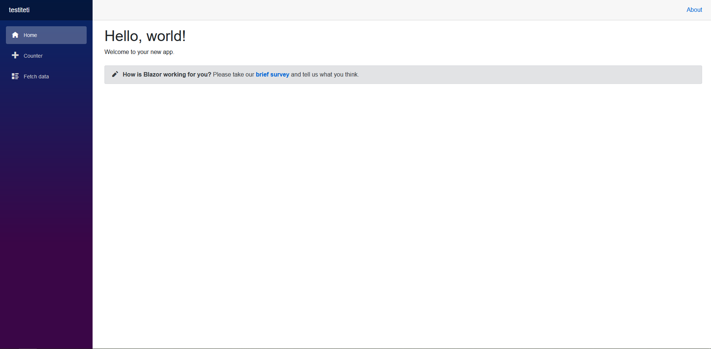
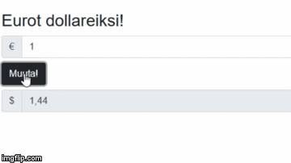
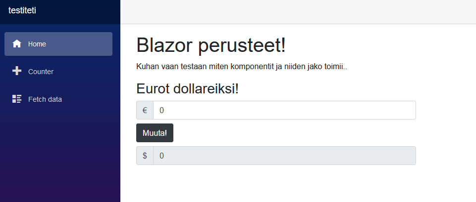
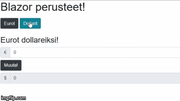

# Blazor


### Sisällyksen pöytä

## [Yleistä](#yleistä)
>### [.NET](#NET)
>### [ASP.NET](#aspnet)
## [Mikä on Blazor?](#mikä-on-blazor)
>### [Rakenne](#rakenne)
>### [Komponentit](#komponentit)
>>#### [@Page](#page)
>>#### [@Layout](#layout)
>### [JavaScript Interop](#javascript-interop)
## [Blazorin mallit](#blazorin-mallit)
>### [Blazor Server](#blazor-server)
>>#### [SignalR](#signalr)
>### [Blazor WebAssembly](#blazor-webassembly)
>>#### [WebAssembly](#webassembly)
## [Esimerkki](#esimerkki)
## [Tehtävä](#tehtävä)


# Mitä tarviit?

# Yleistä
Blazor on Microsoftin kehittämä Front-end web-sovelluskehys, minkä avulla pystytään luomaan SPA-sovelluksia hyödyntämällä C#-ohjelmointikieltä ja .NET-ympäristöä. Tästä syystä websovelluskehityksen tukena on laaja kirjo Microsoftin kehittämiä kirjastoja, sekä valmis infrastruktuuri kehitystä varten.

## .NET

Kuten edellisessä kappaleessa kerrottiin, .NET-ohjelmistokehys tarjoaa laajan valikoiman kirjastoja sovelluskehitykseen. Näistä kaikille tutuin kirjasto Ohjelmoinnin Perusteet-kurssilta lienee System, mikä on C#-kielen olennaisin kirjasto.
```c#
System.Console.Writeline("Hello World!");
```
_Yllä oleva esimerkki kuvastaa System-kirjastosta löytyvän Console-luokan Writeline-metodia. Normaalissa tilanteessa System-kirjasto on otettu käyttöön jo projektin luodessa, joten pelkkä ```Console.Writeline()``` riittää._

Kattavan luokkakirjaston lisäksi muita .NET:n ominaisuuksia voi lukea [**tästä linkistä!**](https://docs.microsoft.com/fi-fi/dotnet/standard/)

[**.NET Core vs .NET Framework**](https://docs.microsoft.com/fi-fi/dotnet/standard/choosing-core-framework-server?toc=%2Faspnet%2Fcore%2Ftoc.json&bc=%2Faspnet%2Fcore%2Fbreadcrumb%2Ftoc.json&view=aspnetcore-3.0) - Hyödyllinen linkki kertomaan näiden kahden termin eroja ja niiden eri käyttötarkoituksista.

[**.NET:n Github-repositorio**](https://github.com/dotnet)

## ASP.NET<div>

Jos C#-kielellä halutaan luoda dynaamisia web-sovelluksia, pelkkä .NET-kehys ei siihen riitä. Tätä varten Microsoft on kehittänyt ASP.NET-ohjelmistokehyksen .NET:n rinnalle. ASP<span>.NET on vapaata lähdekoodia ja sisältää omien (ja perus .NET:n) luokkakirjastojen lisäksi valmiita kehyksiä websovellusten tekoon, kuten [MVC](https://docs.microsoft.com/fi-fi/aspnet/core/mvc/overview?view=aspnetcore-3.0) ja [Web Forms](https://docs.microsoft.com/fi-fi/aspnet/web-forms/). Blazor on ASP.NET-perheen uusin lisäys, minkä ensimmäinen versio lisättiin ASP<span>.NET Core versiossa 3.0 (kirjoitushetkellä uusin virallinen julkaisu).

```c#
@{
    var message = "";
    var weekday = DateTime.Now.DayOfWeek;
    var day = weekday.ToString();
}
<html>
    <body>
        @switch(day)
        {
            case "Monday":
                message = "This is the first weekday.";
                break;
            case "Thursday":
                message = "Only one day before weekend.";
                break;
            case "Friday":
                message = "Tomorrow is weekend!";
                break;
            default:
                message = "Today is " + day;
                break;
        }
        <p> @message </p>
    </body>
</html>
```
_Yllä olevassa kuvassa [w3schools-sivulta](https://www.w3schools.com/asp/showfile_c.asp?filename=try_razor_cs_013) lainattu esimerkki ASP-sovelluksesta._

[**ASP.NET Core:n dokumentaatio**](https://docs.microsoft.com/en-us/aspnet/core/?view=aspnetcore-3.0)

[**ASP.NET vs ASP.NET Core**](https://docs.microsoft.com/en-us/aspnet/core/fundamentals/choose-aspnet-framework?view=aspnetcore-3.0) - Hyödyllinen linkki kertomaan näiden kahden termin eroja ja niiden eri käyttötarkoituksista.

[**ASP.NET:n Github-repositorio**](https://github.com/aspnet)

# Mikä on Blazor?

Blazor toimii samalla tavalla kuten moni Front-end sovelluskehys, millä pystyy luomaan SPA-sovelluksia. Blazorin rakenne perustuu Razor-komponentteihin, millä voidaan hajauttaa sovelluksen kokonaisuuksia pienempiin osioihin. Tämä helpottaa koodin lukua, sekä myös mahdollistaa saman ominaisuuden käytön muualla sovelluksessa ilman uudelleenkirjoittamista.

Razor-komponenttien tiedostotyyppi on .razor, mikä käyttää ASP<span>.NET:n omaa [Razor-syntaksia](https://docs.microsoft.com/fi-fi/aspnet/core/mvc/views/razor?view=aspnetcore-3.1). Razor syntaksi yhdistää Html- ja C#-kielet samaan tiedostoon, jotta komponentin logiikka ja ulkoasu pystytään tuottamaan samassa tiedostossa. ```@```-symbolin avulla voidaan sisällyttää C#-koodia html:n sekaan.

``` html
<div class="warning" style="display:@_displaymessage">@Message</div>
```
_Ylhäällä olevassa esimerkissä kaksi html-koodin sisään upotetusta C#-muuttujasta. Muuttujia voi jopa käyttää elementin tyylin määrittelyssä, kuten tässä esimerkissä vaikuttamaan kyseisen elementin renderöintiin._

ASP<span>.NET:n vuoksi Blazorin kehitykseen on ns. pellin alla valmiina kattava infrastruktuuri, joten kehittäjä voi keskittyä vaan luomaan kattavia web-sovelluksia. Blazorin keskeisimpiä ominaisuuksia ovat:

- [**Reititys**](https://docs.microsoft.com/fi-fi/aspnet/core/blazor/routing?view=aspnetcore-3.1)
- [**Layouts**](https://docs.microsoft.com/fi-fi/aspnet/core/blazor/layouts?view=aspnetcore-3.1)
- [**Lomakkeet ja validointi**](https://docs.microsoft.com/fi-fi/aspnet/core/blazor/forms-validation?view=aspnetcore-3.1)
- [**Dependency injection**](https://docs.microsoft.com/fi-fi/aspnet/core/blazor/dependency-injection?view=aspnetcore-3.1)
- [**JavaScript Interop**](https://docs.microsoft.com/fi-fi/aspnet/core/blazor/javascript-interop?view=aspnetcore-3.1)

Dokumentissa käydään enemmän tai vähemmän läpi näitä ominaisuuksia. Lisää yllä mainituista ja myös muista ominaisuuksista voit lukea alla olevasta linkistä.

[**Blazorin dokumentaatio**](https://docs.microsoft.com/en-us/aspnet/core/blazor/?view=aspnetcore-3.1)

[**Blazorin Github-repositorio**](https://github.com/aspnet/Blazor)

[**Kattava ja ajankohtainen luento Blazorista**](https://www.youtube.com/watch?v=6BT2AF9PO5g)

## Rakenne

Täysin uudesta Blazor-projektista löytyy tiedostoja ja hakemistoja, joista on hyvä tietää seuraavanlaista:

- **Program.cs** - Sisältää sovelluksen aloituspisteen. Oletuksena kaikilla ASP<span>.NET:n sovelluksilla.
- **Startup.cs** - Kaikki sovelluksen käynnistykseen liittyvä logiikka sisällytetään tänne. Luokka sisältää 2 eri metodia:
    - ```ConfigureServices```-metodi konfiguroi sovelluksen mahdolliset [Dependency Injection](https://docs.microsoft.com/en-us/aspnet/core/fundamentals/dependency-injection?view=aspnetcore-3.1)-servicet, tapa luoda kevyitä, uudelleen toistettavia ratkaisuja sovellukseen.
    - ```Configure```-metodi luo sovellukselle pipeline-prosessin. Oletuksena ```Configure``` lisää komponenttien juuren, App-komponentin DOMiin ```<app>```-elementiksi **(Vain WebAssembly-mallissa)**.
- **wwwroot** - sisältää sovelluksen staattisen sisällön, kuten kuvat, skriptit ja tyylittelyt. Omia skripti- ja tyylitiedostoja voi laittaa tänne.
- **wwwroot/index.html** **(Blazor WebAssembly)** - Sovelluksen juuritiedosto, mihin sovelluksen logiikka renderöidään. Sisältää perus Html-rungon lisäksi aiemmin mainitun App-komponentin. blazor.webassembly.js-tiedosto implementoidaan mukaan, mikä hoitaa .NET-ajoympäristön, sovelluksen ja sovelluksen riippuvuuksien latauksen käyttäjälle, sekä suorittaa sovelluksen ajoa selaimessa.
- **Pages/_Host.cshtml** **(Blazor Server)** - Sovelluksen juuritiedosto, mikä renderöinnin jälkeen lähetetään käyttäjälle. Sisältää Razor-syntaksia ja hoitaa App-komponentin renderöinnin. blazor.server.js-tiedosto implementoidaan mukaan, mikä asettaa yhteyden palvelimen ja selaimen välille SignalR:n avulla.
- **App.razor** - Sovelluksen pääkomponentti, joka hoitaa [reitityksen](https://docs.microsoft.com/fi-fi/aspnet/core/blazor/routing?view=aspnetcore-3.1) ja [ulkoasun](https://docs.microsoft.com/fi-fi/aspnet/core/blazor/layouts?view=aspnetcore-3.1) määrittelyn.
- **Pages** - Hakemisto komponenteille mitkä on määritetty sivuiksi ```@page```-direktiivillä, joita voidaan hakea reitityksellä.
- **_Imports.razor** - Sisällyttää kaikki yleiset sovelluksen tarvittavat kirjastot ja luokat. Käyttäjä voi sisällyttää omia hakemistoja ja niiden komponentteja tai tiedostoja ```@using {projektin_nimi}.{hakemiston_nimi}```-esimerkillä.

## Komponentit

Kuten aiemmin jo mainittu, komponenttien avulla sovellus voidaan hajauttaa pienimpiin osioihin, helpottaen koodin luettavuutta ja vähentämään toistuvuutta. Kehittäjän ei suotta tarvitse kirjoittaa uudelleen sovelluksen ominaisuutta, jos sen voi vaan upottaa sivulta toiselle yhdellä ```<ElementinNimi />```-tägillä.

### @Page

```@page```-direktiivillä määritetty komponentti toimii sovelluksen sivuna, minkä voi hakea sille määritetyn reitin mukaan.

``` html
@page "/"

<main>
    <h1>Hello, World!</h1>
</main>
```
_Yllä olevassa esimerkissä komponentti, mille on annettu ```@page```-direktiivillä sovelluksen juuripolku._

Yhdelle komponentille voi myös määrittää useamman reitin ja reiteille voi antaa parametreja.

``` c#
@page "/"
@page "/Homepage"
@page "/Homepage/{variable}"

<main>
    <h1>Hello, World!</h1>
</main>

@code{
    [Parameter]
    public string variable { get; set; } = "sivu";
}
```
_Nyt sivu voidaan löytää esimerkiksi osoitteesta ```localhost:5000/Homepage/sivu```_

### @Layout

``` html
<!-- MainLayout.razor -->
@inherits LayoutComponentBase

<HeaderLayout />

<main>
    @Body
</main>

<FooterLayout />
```
_Ylhäällä olevassa esimerkissä nähdään Blazorin oletus layout-komponentti ```MainLayout``` ja sen sisälle upotetut ```Header```- ja ```FooterLayout```-komponentit. ```LayoutComponentBase```-luokasta peritty ```@Body```-syntaksilla määritetään, mihin sovelluksen sisältö renderöidään._

Layout-komponenteilla voidaan määrittää sovellukselle ulkoasun, mitä koko softa tai osa sitä käyttää. Näiden avulla voidaan luoda yhtenäinen ulkoasu sovelluksen jokaiselle näkymälle. Sovellus tarvitsee yhden Layout-komponentin oletukseksi ```App.razor```-tiedostoon.

``` html
<!-- App.razor -->
<Router AppAssembly="@typeof(Program).Assembly">
    <Found Context="routeData">
        <RouteView RouteData="@routeData" DefaultLayout="@typeof(MainLayout)" />
    </Found>
    <NotFound>
        <LayoutView Layout="@typeof(MainLayout)">
            <p>Sorry, there's nothing at this address.</p>
        </LayoutView>
    </NotFound>
</Router>
```
_Ylhäällä olevassa esimerkissä ```App.razor```-tiedosto, mikä määrittää sovelluksen reitityksen ja ulkoasun, mikäli jos tietystä reitistä löytyy tai ei löydy komponenttia. Lisää Router-komponentista voit lukea [täältä.](https://docs.microsoft.com/en-us/aspnet/core/blazor/routing?view=aspnetcore-3.1#route-templates)_

Sovellukselle voi myös luoda vaihtoehtoisia näkymiä ja antaa niitä suoraan komponenttien käyttöön ```@layout {Layout-komponentin_nimi}```-direktiivillä.

``` c#
@page "/Todo"
@layout SecondLayout
```

[**Lisää layout-komponenteista**](https://docs.microsoft.com/fi-fi/aspnet/core/blazor/layouts?view=aspnetcore-3.1)

## JavaScript Interop

Blazor-sovellus pystyy kutsumaan JavaScript funktioita omilla metodeillaan JavaScript Interop:n avulla. Tällä voidaan vaikuttaa DOMin tai selaimen ominaisuuksiin, joihin Blazorilla ei välttämättä (vielä) pääse käsiksi. Kehittäjällä on myös tämän myötä enemmän mahdollisuuksia soveltaa kehityksessä, eikä sovellusta rajoiteta tietyn teknologian vuoksi.

Esimerkkinä käytetään yksinkertaista konsolin logausta. (Blazorilla tosin pystyy myös suoraan tulostaa konsoliin .NET:n omalla ```Console.Writeline```-metodilla)
``` javascript
// scripts.js
window.helloWorld = {
    console.log('Hello, World!') 
}
```

Yllä oleva skripti sijaitsee ```scripts.js```-tiedostossa, mikä pitää sijoittaa sovelluksen juuritiedostoon (_WebAssembly-mallissa wwwroot/index.html ja Server-mallissa Pages_/__Host.cshtml_). Tämän jälkeen voidaan palata takaisin Razor-komponenttiin ja lisätä tarvittava logiikka. ```@inject```-direktiivillä saadaan komponentille käyttöön Interop:n ```IJSRuntime```-rajapinta, minkä avulla luodaan asynkronisia pyyntöjä JavaScript-tiedostoihin.

``` html
<!-- Index.razor -->
@inject IJSRuntime _JSRuntime;
```
__Imports.razor-tiedostosta löytyy automaattisesti Microsofting Interop-kirjasto, joten erikseen ei tarvitse asentaa uusia kirjastoja ominaisuuden käyttöönottoa varten._

Seuraavaksi tarvitaan vaan kirjoittaa komponenttiin pyyntö oikeaan funktioon käyttämällä juuri [dependency injection](https://docs.microsoft.com/fi-fi/aspnet/core/blazor/dependency-injection?view=aspnetcore-3.1)-ominaisuutta avulla tuotua rajapintaamme.

``` c#
// Index.razor @code-lohko
protected override void OnInitialized()
{
    JSRuntime.InvokeVoidAsync("helloWorld");
}
```
_```protected override void OnInitialized()``` on yksi Blazor-sovelluksen synkronisista lifecycle-metodeista. Lisää näistä voit lukea [täältä](https://docs.microsoft.com/fi-fi/aspnet/core/blazor/lifecycle?view=aspnetcore-3.1)_

Ajaessa sovellusta Index.razor-tiedostosta selaimen konsoliin pitäisi tulla funktion mukainen tuloste. Lisää Interop:sta ja sen ominaisuuksista voit lukea alla olevasta linkistä.

[**JavaScript Interop**](https://docs.microsoft.com/fi-fi/aspnet/core/blazor/javascript-interop?view=aspnetcore-3.1)


# Blazorin mallit

Blazorista on kirjoitushetkellä saatavilla 2 versiota, joiden toiminnallisuus eroaa vain tavasta tuoda sovellus käyttäjälle.

## Blazor Server

Blazorin ensimmäinen versio, Blazor Server, toimii suht perinteisellä tavalla. Applikaatio sekä pyörii että ajaa toimintoja ASP.NET-palvelimelta käsin, jolloin kaikki muutokset tapahtuvat loppukäyttäjän selaimen ulkopuolella ja selaimelle tuodaan vain päivitetty DOM. Eli jos käyttäjä painaa painiketta mikä vaihtaa ruudulla näkyvän luvun arvoa yhdellä, tehdään pyyntö palvelimelle missä Blazor tekee tarvittavat muutokset komponenttiin/komponentteihin ja palauttaa nämä takaisin käyttäjän selaimelle. Kaikki nämä muutokset tuodaan ja viedään SignalR-komponentin välityksellä. Blazor Server julkaistiin ASP<span>.NET Core 3.0 version mukana.


_Yllä olevassa kuvassa kuvattu Blazor Serverin toiminnallisuutta. Kuva on lainattu Microsoftin [Blazor-dokumentaatiosta](https://docs.microsoft.com/en-us/aspnet/core/blazor/?view=aspnetcore-3.1)._

Loppukäyttäjän selaimen tuen ja suorituskyvyn riippumattomuus tekee Blazor Serveristä vahvan valinnan isojenkin sovelluksien luontiin, sillä selaimelle ei tarvitse ladata kuin Blazorin luoma dynaaminen websovellus. Tällöin olisi myös käytössä täysi tuki .NET:n työkaluihin, eikä sovelluksen komponentteja/koodia tuoda käyttäjälle. Internet yhteyden välinen viive voi toisaalta koitua hankalaksi, sillä käyttäjä ei välttämättä heti koe tapahtuvaa muutosta ja se voi pilata käyttäjäkokemuksen. Hyvään verkkoinfrastruktuuriin on siis kannattavaa investoida.

[**Blazor Server**](https://docs.microsoft.com/en-us/aspnet/core/blazor/hosting-models?view=aspnetcore-3.1#blazor-server)

### SignalR

Microsoftin kehittämän SignalR komponentin avulla Blazor Server pystyy kommunikoimaan selaimen kanssa, saaden tietoa tarvittavista käyttöliittymän muutoksista ja palauttamaan pyyntöjen mukaisen tuloksen takaisin loppukäyttäjälle. SignalR hyödyntää HTML5:n [WebSocket](https://javascript.info/websocket) APIa toimiakseen realiajassa.

[**SignalR dokumentaatio**](https://docs.microsoft.com/en-us/aspnet/core/signalr/introduction?view=aspnetcore-3.1)

## Blazor WebAssembly

Blazor Wasm, eli Blazor WebAssembly, on uudempi hostausmalli, mikä käyttää nimensä mukaisesti [WebAssembly-teknologiaa](https://webassembly.org/) pyörittämään .NET-applikaatioita suoraan selaimessa. Palvelimelta käyttäjän selaimelle ladataan C# ja Razor tiedostoista koostuvat .NET assembly-tiedostot, sekä .NET-ajoympäristö, minkä avulla Blazor Wasm pystyy konfiguroimaan assembly-tiedostoista staattiset tiedostot sovelluksen ajoa varten. Tämän toimenpiteen jälkeen Blazor applikaatio toimii ilman erillisen .NET-palvelimen riippuvuutta. Blazor Wasm:n on tarkoitus julkaista ASP<span>.NET Core 3.1 version mukana, minkä arvioidaan kirjoitushetkellä julkaistavan toukokuussa 2020.


_Yllä olevassa kuvassa kuvattu Blazor WebAssemblyn toiminnallisuutta. Kuva on lainattu Microsoftin [Blazor-dokumentaatiosta](https://docs.microsoft.com/en-us/aspnet/core/blazor/?view=aspnetcore-3.1)._

Vaikka Blazor WebAssembly on vielä kehitysvaiheessa oleva vaihtoehto Blazor-applikaatioiden luontiin, on se hyväksi vaihtoehdoksi Serverin rinnalle todettu. Koska Blazor Wasm tuottaa julkaisuvaiheessa sovelluksesta staattisia tiedostoja, ei palvelimen tarvitse suoraan olla .NET-palvelin, vaan mikä tahansa palvelin tai sisällönjakotapa kelpaa. Kuhan selain tukee WebAssembly-teknologiaa ja sovellus on kevyt ladata selaimelle (Riippuu sovelluksen koosta. Buildattujen sovelluksien kokoa kehitetään vielä.), viiveetön interaktiivisuus piristää mukavasti käyttäjäkokemusta, varsinkin jos sovellukseen sisällytetään mukaan myös PWA-mahdollisuudet. Sovelluksen latauskoon lisäksi täytyy ottaa myös huomioon, että WebAssemblyn kanssa Blazor käyttää loppukäyttäjän hardwarea, joten suorituskyky on tärkeässä asemassa. Myös kaikkia .NET:n ominaisuuksia ei pystytä vielä kirjoitushetkellä toteuttamaan.

[**Blazor WebAssembly**](https://docs.microsoft.com/en-us/aspnet/core/blazor/hosting-models?view=aspnetcore-3.1#blazor-webassembly)

### WebAssembly

WebAssembly on matalan tason ohjelmointikieli, minkä avulla selainympäristössä voi ajaa korkean tason ohjelmointikieliä, kuten C ja C++, kääntämällä lähdekoodi binäärimuotoon mitä selain kykenee lukemaan. Käännetty sovellus ajetaan tämän jälkeen selaimen JavaScript-moottorin(?) päällä. Wasmin avulla pystytään luomaan optimoituja websovelluksia kielillä, joiden alkup. tarkoitus on selainten ulkopuolella ja mihin JavaScriptin suorituskyky ei riitä. WebAssembly myös toimii JavaScriptin kanssa yhteistyössä. .NET hyödyntää tämän teknologian tarjoamia mahdollisuuksia kääntämään ja ajamaan Blazor Wasmin tiedostot natiivisti selainympäristössä ilman ylimääräisten lisäosien asentamista. WebAssembly on vapaata lähdekoodia ja [toimii kaikissa moderneissa selaimissa.](https://caniuse.com/#feat=wasm)

[**WebAssemblyn kotisivu**](https://webassembly.org/)

[**Lisätietoa WebAssemblystä**](https://blog.logrocket.com/webassembly-how-and-why-559b7f96cd71/)

[**WebAssembly Editor**](https://mbebenita.github.io/WasmExplorer/) ja [**WebAssembly Studio(BETA)**](https://webassembly.studio/) - Selaimessa toimivia IDE ratkaisuja C ja C++ kielille

[**D3wasm**](https://wasm.continuation-labs.com/d3demo/) - Tech demo Doom 3:sta pyörimässä selainympäristössä

# Esimerkki

Esimerkkiä varten luodaan uusi Blazor-projekti ```dotnet new blazorwasm -o {projektin nimi}```, mikä luo uuden projektin hakemistoineen päivineen Blazor sovellukselle, käytten WebAssembly-mallia. Toimii myös Blazor Server-mallilla kirjoittamalla ```dotnet new blazorserver -o {projektin nimi}```. Voit testata luonnin onnistumisen siirtymällä projektin hakemistoon ja ajamalla sovellus komennolla ```dotnet run```. Uusi Blazor-sovellus pitäisi näyttää alla olevan kuvan mukaiselta ja se löytyy osoitteesta [http://localhost:5000/](http://localhost:5000/).



Jatketaan esimerkkiä lisäämällä siihen logiikkaa. Luodaan simppeli valuutanvaihto-komponentti sovellukselle. Sovellus käyttää valmiiksi asennettua Bootstrap tyylikehystä.

``` c#
<!-- CurrencyConverter.razor -komponentti -->

<h3>Eurot dollareiksi!</h3>

<div class="input-group">
    <div class="input-group-prepend">
        <span class="input-group-text" id="basic-addon1">€</span>
    </div>
    <input type="text" class="form-control" @bind=Euros>
</div>

<button type="button" @onclick=Convert class="btn btn-dark">Muuta!</button>

<div class="input-group mb-3">
    <div class="input-group-prepend">
        <span class="input-group-text" id="basic-addon1">$</span>
    </div>
    <input type="text" disabled class="form-control" @bind=Dollars>
</div>

@code {

    private double Euros { get; set; }
    private double Dollars { get; set; }

    private void Convert() 
    {
        Dollars = Euros * 1.44;
    }
}
```
Yllä luodussa CurrencyConverter-komponentissa logiikka toimii seuraavasti: Käyttäjä kirjoittaa muutettavan arvon ylempään ```<input>``` elementtiin, joka sisällyttää arvon ```@bind```-parametrin sisältävään muuttujaan ( _```@bind``` on Razor-komponentin [two-way data binding-ominaisuus](https://learn-blazor.com/pages/data-binding/)_ ). Tämän jälkeen kun käyttäjä painaa ```<button>``` painiketta, elementin sisältämä ```@onclick``` eventtiin bindattu ```Convert``` metodi kutsutaan. Dollariksi käännetty rahasumma annetaan toiselle muuttujalle, mikä on vuorostaan bindattu alempaan ```<input>``` elementtiin.



Komponentin lopputulos näyttää yllä olevan kuvan mukaiselta. Koodia pystyisi nyt käyttämään, kuhan siihen päästään käsiksi sovelluksen kautta. Kaksi vaihtoehtoa löytyy: joko komponentille asetetaan polku ```@page``` direktiivillä, tai sisällyttämällä se komponenttiin mistä löytyy jo kyseinen direktiivi.

``` html
<!-- Index.razor -komponentti. "/" merkitsee kyseisen sivukomponentin polkua, tässä tilanteessa toimien sovelluksen etusivuna. -->

@page "/"

<main>
    <h1>Blazor perusteet!</h1>

    <p>Sisällytetään vähän komponentteja!</p>

    <CurrencyConverter />
</main>
```

```<CurrencyConverter />``` elementti sisältää ylhäällä luodun valuutanvaihto-komponentin. Elementin nimi pitää täsmätä tarkkaan komponentin tiedostonimen kanssa ja tiedoston polku pitää löytyä _Imports-tiedostosta. Tämän jälkeen sovellusta voidaan nähdä jälleen ```dotnet run```-komennolla.

_Vinkki: komennolla ```dotnet watch run``` sovellus päivittyy automaattisesti ja muutoksia varten tarvitsee vain päivittää sivu. Näin vältetään jatkuvaa ```run```-komennon sulkemista ja ajamista._



Komponentteihin voidaan myös sisällyttää parametreja, joiden avulla voidaan vaikuttaa komponentin logiikkaan isäntäkomponentista käsin. Jatketaan esimerkkiä siten, että lisätään mahdollisuus vaihtaa dollarit takaisin euroiksi alhaalla olevan gifin tavoin.



Ensimmäinen muutos tapahtuu CurrencyConverter-komponentissa, mihin käydään tekemään muutamia muutoksia.

``` c#
<!-- CurrencyConverter.razor -->
<h3>@ComponentTitle</h3>

<div class="input-group">
    <div class="input-group-prepend">
        <span class="input-group-text" id="basic-addon1">@(WhichCurrency == "euros" ? "€" : "$")</span>
    </div>
    <input type="text" class="form-control" @bind=Value>
</div>

<button type="button" @onclick=Convert class="btn btn-dark">Muuta!</button>

<div class="input-group">
    <div class="input-group-prepend">     
        <span class="input-group-text" id="basic-addon1">@(WhichCurrency == "euros" ? "$" : "€")</span>
    </div>
    <input type="text" disabled class="form-control" @bind=ChangedValue>
</div>

@code {

    [Parameter]
    public string WhichCurrency { get; set; }

    [Parameter]
    public string ComponentTitle { get; set; }
    
    private double Value { get; set; }
    private double ChangedValue { get; set; }

    private void Convert() {
        if(WhichCurrency == "euros") 
        {
            ChangedValue = Math.Round(Value * 1.44, 2);
        } else 
        {
            ChangedValue = Math.Round(Value * 0.71, 2);
        }
    }
}
```

Komponentin muutokset ovat seuraavat: Code-lohkoon on lisätty 2 uutta **julkista** komponenttia, ```WhichCurrency``` ja ```ComponentTitle``` ( _Huomioi myös muutokset alkuperäisiin muuttujiin ja funktioon_ ). Näille on annettu ```Component parameter```-määrittely ```[Parameter]``` ominaisuudella. Nyt näiden kahden muuttujan arvoihin pääsee käsiksi komponentin ulkopuolelta, mikä auttaa huomattavasti komponentin interaktiivisuuteen. Html koodiin on myös sisällytetty ```ComponentTitle```-muuttujalla bindattu otsikko ja [kolmiarvoinen ehtolauseke](https://docs.microsoft.com/en-us/dotnet/csharp/language-reference/operators/conditional-operator#conditional-ref-expression), jolla tässä tilanteessa vain vaikutetaan oikean rahasymbolin renderöintiin ```@WhichCurrency```-muuttujan mukaan. Kyseinen lauseke pitää sisällyttää [Explicit Razor](https://docs.microsoft.com/en-us/dotnet/csharp/language-reference/operators/conditional-operator#conditional-ref-expression)-lausekkeen sisään, jotta html-koodissa voidaan renderöidä välejä vaativia C#-toimintojen tuloksia.

[**Implicit Razor expression**](https://docs.microsoft.com/en-us/aspnet/core/mvc/views/razor?view=aspnetcore-3.1#implicit-razor-expressions) & [**Explicit Razor expression**](https://docs.microsoft.com/en-us/aspnet/core/mvc/views/razor?view=aspnetcore-3.1#explicit-razor-expressions)

``` c#
<!-- Index.razor -->
@page "/"

<main>
    <h1>Blazor perusteet!</h1>

    <p>
        <button type="button" @onclick=@(() => Change(0)) class="btn btn-dark">Eurot</button>
        <button type="button" @onclick=@(() => Change(1)) class="btn btn-info">Dollarit</button>
    </p>

    <CurrencyConverter WhichCurrency=@Value ComponentTitle=@Title />
</main>

@code {
    private string Value = "euros";
    private string Title = "Eurot dollareiksi!";

    private void Change(int x) 
    {
        if(x == 0) 
        {
            Value = "euros";
            Title = "Eurot dollareiksi!";
        } else 
        {
            Value = "dollars";
            Title = "Dollarit euroiksi!";
        }
    }
}
```

Index-komponenttiin tehdyt muutokset: ```<CurrencyConverter />```-elementille on annettu nyt komponentin parametreihin arvot Index-komponentin omista muuttujista. Muuttujat saavat arvonsa painikkeiden ```@onclick```-eventtien sisällyttämien ```Change``` metodin tuloksesta. Jos eventtiin bindattuun metodiin tarvitaan parametreja, bindaukseen tarvitaan .NET:n [Lambda-lauseketta](https://docs.microsoft.com/en-us/dotnet/csharp/programming-guide/statements-expressions-operators/lambda-expressions). Näiden muutosten jälkeen valutaanvaihto molempiin suuntiin pitäisi toimia, kuten esimerkissä.

Ylemmässä esimerkissä opit data- ja event binding-ominaisuuksista, komponenttien sisällyttämisestä isäntäkomponentteihin, reitityksestä, Razor-syntaksin perusteita ja ehkä myös itse C#-koodia.

[**Blazorin komponentit**](https://docs.microsoft.com/fi-fi/aspnet/core/blazor/components?view=aspnetcore-3.1)

[**Blazorin ulkoasun luonnista**](https://docs.microsoft.com/fi-fi/aspnet/core/blazor/layouts?view=aspnetcore-3.1)

[**Blazorin reitityksestä**](https://docs.microsoft.com/fi-fi/aspnet/core/blazor/routing?view=aspnetcore-3.1)

# Tehtävä

Luo esimerkin neuvoja käyttäen simppeli Todo-sovellus. Voit luoda uuden Blazor-sovelluksen tai käyttää valmista pohjaa Esimerkki-kansiosta. Sovelluksen logiikka täytyy olla omalla sivullaan, tai sitten etusivulla komponentista tuotuna. Varmista että sinulla on kaikki mitä (OTSIKKO TÄHÄN) mukaan tarvitaan Blazor-sovelluksen tekoa varten. Sovellusta varten sun täytyy luoda olio-luokka, mitä voit käyttää sitten Listin kanssa. Kun työ on valmis, zippaa se ja palauta.

EXTRAA TÄHÄN!!!

Käytä JavaScript interoppia

jos teet logiikan omalle sivulle, tuut tutuksi samalla myös ulkoasukomponenttien kanssa. kokeile niitä samalla kun laitat linkkiä navigaatiopalkkiin